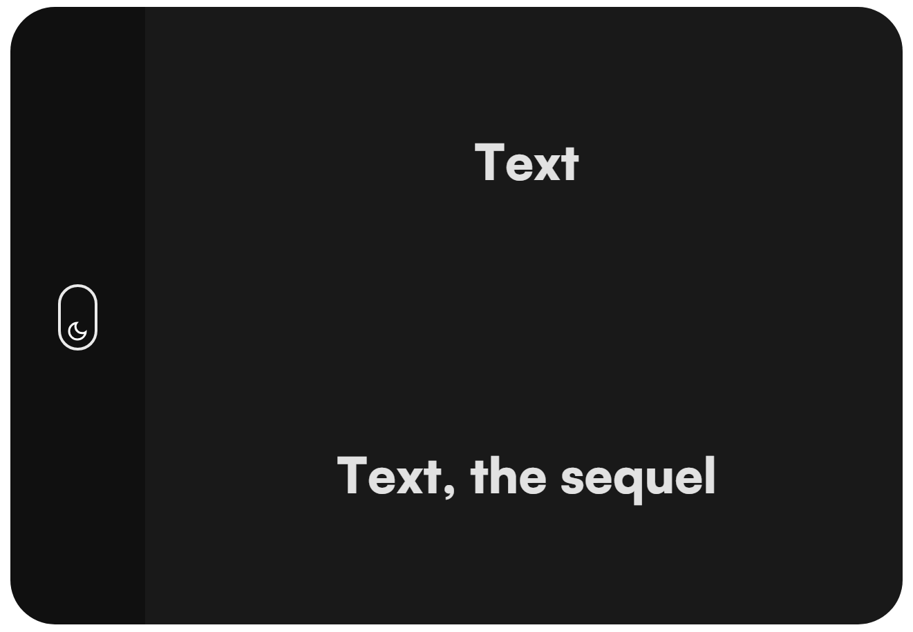

## Commands to get the Website running

| Commands  | Description |
|---|---|
| `npm i` | Install dependencies |
| `npm run sass-dev` | Watch Sass files and compile to CSS |
| `npm run sass-prod` | Compile Sass files to minified CSS (for production)|
| `npm run sync` | Start browsersync server |

### Screenshots

